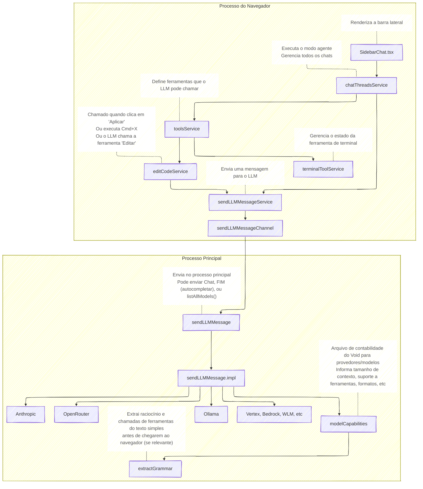

# Guia da Base de Código do Void

A base de código do Void não é tão intimidadora quanto parece!

A maior parte do código do Void está na pasta `src/vs/workbench/contrib/void/`.

O objetivo deste documento é explicar como a base de código do Void funciona. Se você quiser instruções de compilação, veja [Contribuindo](https://github.com/voideditor/void/blob/main/HOW_TO_CONTRIBUTE.md).

## Guia da Base de Código do Void

### Terminologia

Aqui está uma terminologia importante que você deve conhecer se estiver trabalhando dentro do VSCode:

- Um **Editor** é onde você digita seu código. Se você tem 10 abas abertas, isso é apenas um editor! Editores contêm abas (ou "modelos").
- Um **Modelo** é uma representação interna do conteúdo de um arquivo. É compartilhado entre editores (por exemplo, se você pressionar `Cmd+\` para criar um novo editor, o modelo de um arquivo como `A.ts` é compartilhado entre eles. Dois editores, um modelo. É assim que as alterações são sincronizadas).
- Cada modelo tem uma **URI** que representa, como `/Users/.../my_file.txt`. (Uma URI ou "recurso" é geralmente apenas um caminho).
- O **Workbench** é o invólucro que contém todos os editores, o terminal, a árvore do sistema de arquivos, etc.
- Normalmente você usa o tipo `ITextModel` para modelos e o tipo `ICodeEditor` para editores. Não existem muitos outros tipos.

### Resumo Mínimo do VSCode

Aqui está um resumo mínimo do VSCode se você está apenas começando com o Void:

- O VSCode é (e, portanto, o Void é) um aplicativo Electron. O Electron executa dois processos: um processo **main** (para internos) e um processo **browser** (browser significa HTML em geral, não apenas "navegador web").
- O código em uma pasta `browser/` sempre vive no processo do navegador e pode usar `window` e outros itens do navegador.
- O código em uma pasta `electron-main/` sempre vive no processo principal e pode importar `node_modules`.
- O código em `common/` pode ser usado por qualquer processo, mas não recebe importações especiais.
- O ambiente do navegador não tem permissão para importar `node_modules`, mas existem duas soluções alternativas:
  1. Empacotar o código bruto do node_module para o navegador - estamos fazendo isso para o React.
  2. Implementar o código em `electron-main/` e configurar um canal entre main/browser - estamos fazendo isso para sendLLMMessage.

O VSCode é organizado em "Serviços". Um serviço é apenas uma classe que é montada uma única vez (na teoria da ciência da computação, isso é chamado de "singleton"). Você pode registrar serviços com `registerSingleton` para poder usá-los facilmente em qualquer construtor com `@<Service>`. Veja \_dummyContrib para um exemplo que montamos sobre como registrá-los. O registro é o mesmo todas as vezes.

Os serviços são sempre criados de forma preguiçosa, mesmo que você os registre como Eager. Se você quiser algo que sempre seja executado na montagem do Void, você deve usar uma "contribuição de workbench". Veja \_dummyContrib para isso. Muito semelhante a um Serviço, apenas registrado de forma ligeiramente diferente.

Ações ou "comandos" são funções que você registra no VSCode para que você ou o usuário possam chamá-las posteriormente. Você pode executar ações como usuário pressionando Cmd+Shift+P (abre a paleta de comandos), ou pode executá-las internamente usando o commandService para chamá-las por ID. Usamos ações para registrar listeners de atalhos de teclado como Cmd+L, Cmd+K, etc. O legal das ações é que o usuário pode alterar os atalhos de teclado.

Veja [aqui](https://github.com/microsoft/vscode/wiki/Source-Code-Organization) um guia decente do VSCode com ainda mais informações.

Cada seção abaixo contém uma visão geral de uma parte central do código-fonte do Void. Você pode querer rolar para encontrar o item relevante para você.

### Pipeline de Mensagens LLM Internas

Aqui está uma imagem de todas as dependências relevantes entre o momento em que você envia uma mensagem pela primeira vez através da barra lateral do Void e o momento em que uma solicitação é enviada ao seu provedor.
Enviar mensagens LLM do processo principal evita problemas de CSP com provedores locais e nos permite usar node_modules com mais facilidade.



<div align="center">
	
</div>

**Observações:** `modelCapabilities` é um arquivo importante que deve ser atualizado quando novos modelos são lançados!

### Apply

O Void tem dois tipos de Apply: **Fast Apply** (usa Buscar/Substituir, veja abaixo) e **Slow Apply** (reescreve o arquivo inteiro).

Quando você clica em Apply e o Fast Apply está habilitado, solicitamos que o LLM gere blocos de Buscar/Substituir como este:

```
<<<<<<< ORIGINAL
// código original aqui
=======
// código substituído aqui
>>>>>>> UPDATED
```

Isso é o que permite que o Void aplique código rapidamente mesmo em arquivos de 1000 linhas. É o mesmo que pedir ao LLM para pressionar Ctrl+F e inserir uma consulta de busca/substituição.

### Funcionamento Interno do Apply

O arquivo `editCodeService` executa o Apply. O mesmo código exato também é usado quando o LLM chama a ferramenta Edit e quando você submete Cmd+K. Apenas versões diferentes do modo Fast/Slow Apply.

Aqui está uma terminologia importante:

- Uma **DiffZone** é uma região {startLine, endLine} na qual mostramos Diffs (áreas vermelhas/verdes). Atualizamos quando o usuário digita, então está sempre precisa.
- Uma **DiffArea** é uma generalização que rastreia números de linha como uma DiffZone.
- O único tipo de zona que pode "transmitir" é uma DiffZone. Cada DiffZone tem um llmCancelToken se estiver transmitindo.
- Quando você clica em Apply, criamos uma **DiffZone** sobre o arquivo inteiro para que quaisquer alterações que o LLM faça apareçam em vermelho/verde. Em seguida, transmitimos a alteração.
- Quando um LLM chama Edit, na verdade está chamando Apply.
- Quando você submete Cmd+K, é o mesmo que Apply, exceto que criamos uma DiffZone menor (não no arquivo inteiro).

### Funcionamento Interno da Escrita de Arquivos

Quando o Void quer alterar seu código, ele simplesmente escreve em um modelo de texto. Isso significa que tudo o que você precisa saber para escrever em um arquivo é sua URI - você não precisa carregá-lo, salvá-lo, etc. Existem algumas coisas irritantes de fundo de URI/modelo para pensar para fazer isso funcionar, mas lidamos com todas elas em `voidModelService`.

### Funcionamento Interno das Configurações do Void

Temos um serviço `voidSettingsService` que armazena todas as suas configurações do Void (provedores, modelos, configurações globais do Void, etc). Imagine isso como uma dependência implícita para qualquer um dos serviços principais do Void:

<div align="center">
	
</div>

Aqui está um guia para alguns dos termos que estamos usando:

- **FeatureName**: Autocomplete | Chat | CtrlK | Apply
- **ModelSelection**: um par {providerName, modelName}.
- **ProviderName**: O nome de um provedor: `'ollama'`, `'openAI'`, etc.
- **ModelName**: O nome de um modelo (tipo string, ex: `'gpt-4o'`).
- **RefreshProvider**: um provedor que pingamos repetidamente para atualizar a lista de modelos.
- **ChatMode** = normal | gather | agent

### Estado de Aprovação

As estruturas de dados de `editCodeService` contêm todas as informações sobre alterações que o usuário precisa revisar. No entanto, elas não armazenam essas informações em um formato útil. Escrevemos o seguinte serviço para obter um estado derivado mais útil:

<div align="center">
	
</div>

### Processo de Compilação

Se você quiser saber como nosso pipeline de compilação funciona, veja nosso repositório de compilação [aqui](https://github.com/voideditor/void-builder).

## Guia da Base de Código do VSCode (Não Void)

A equipe do Void reuniu esta lista de links para ajudar a entender o código-fonte do VSCode, a base do Void. Esperamos que seja útil!

#### Links para Iniciantes

- [Guia de UI do VSCode](https://code.visualstudio.com/docs/getstarted/userinterface) - aborda auxbar, painéis, etc.
- [Guia de UX](https://code.visualstudio.com/api/ux-guidelines/overview) - aborda Containers, Views, Items, etc.

#### Links para Contribuidores

- [Como o código-fonte do VSCode é organizado](https://github.com/microsoft/vscode/wiki/Source-Code-Organization) - isso explica onde estão os arquivos de ponto de entrada, o que `browser/` e `common/` significam, etc. Esta é a leitura mais importante de toda esta lista! Recomendamos ler tudo.
- [Estilos incorporados do VSCode](https://code.visualstudio.com/api/references/theme-color) - variáveis CSS incorporadas no VSCode. Use `var(--vscode-{tema substituindo . por -})`. Você também pode ver o [guia de temas de Webview](https://code.visualstudio.com/api/extension-guides/webview#theming-webview-content).

#### Diversos

- [Todos os comandos](https://code.visualstudio.com/api/references/commands) incorporados no VSCode - não usado com frequência, mas aqui para referência.
- Nota: O repositório do VSCode é o código-fonte do editor Monaco! Um "editor" é um editor Monaco, e ele compartilha o código para ITextModel, etc.

#### API de Extensão do VSCode

O Void não é mais uma extensão, então esses links não são mais necessários, mas podem ser úteis se algum dia construirmos uma extensão novamente.

- [Arquivos necessários em uma extensão](https://code.visualstudio.com/api/get-started/extension-anatomy).
- [Esquema de `package.json` de uma extensão](https://code.visualstudio.com/api/references/extension-manifest).
- [Guia de &#34;Contributes&#34;](https://code.visualstudio.com/api/references/contribution-points) - a parte `"contributes"` de `package.json` é como uma extensão é montada.
- [A API completa de extensão do VSCode](https://code.visualstudio.com/api/references/vscode-api) - olhe no lado direito para organização. O [final](https://code.visualstudio.com/api/references/vscode-api#api-patterns) da página é fácil de perder, mas é útil - tokens de cancelamento, eventos, descartáveis.
- [Eventos de ativação](https://code.visualstudio.com/api/references/activation-events) que você pode definir em `package.json` (não é o mais útil).
